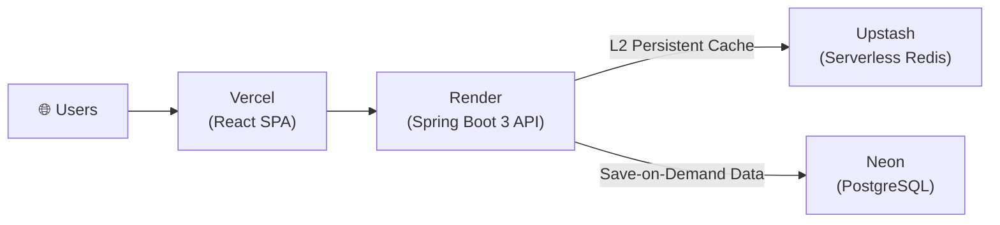

# 🚀 HiredAI — AI-Powered Job Application & Multi-Feed Aggregation Platform

**HiredAI** is a high-performance, full-stack job application and feed aggregation platform designed to streamline remote job hunting. It aggregates real-time job listings across public job boards and custom feeds (RSS, Atom, JSON APIs) into a single unified workspace, matching candidates against job roles using automated resume skill extraction and match scoring algorithms.

---

## 🛠️ Technology Stack & Architectural Choices

### **Backend Core: Java 21 & Spring Boot 3**
- **Why Java 21?**: Capitalizes on modern Java features (Record types, Pattern Matching, Sealed Interfaces, Virtual Threads compatibility) for clean, type-safe, and concurrent backend code execution.
- **Why Spring Boot 3?**: Provides enterprise-grade dependency injection, robust JPA/Hibernate ORM capabilities, declarative security (`Spring Security`), and seamless REST controller abstractions with dynamic query filtering.

### **Frontend: React 18, TypeScript & Material-UI (MUI v5)**
- **Why React 18 & TypeScript?**: Ensures strict compile-time type safety across API DTOs and page state, enabling scalable component architectures with zero dynamic type bugs.
- **Why MUI v5 & Custom Styling System**: Built using custom visual tokens (custom HSL/HEX palette, responsive breakpoints, smooth animations, slide-up drawers for mobile filtering) to deliver a state-of-the-art visual experience across all screen sizes.

### **Two-Tier Caching & Database: Redis + In-Memory + PostgreSQL (Save-on-Demand)**
- **Why Two-Tier Caching (L1 JVM + L2 Redis)?**: 
  - **L1 In-Memory (`ConcurrentHashMap`)**: Delivers sub-millisecond (`< 0.05ms`) search, keyword matching, platform filtering, and pagination from JVM heap with zero network hops.
  - **L2 Redis (Upstash in Prod / Docker locally)**: Stores listings in a Redis Hash (`hiredai:jobs`), persisting the aggregated feed across backend restarts and redeployments with fast startup hydration (~10ms) and automatic 7-day TTL.
  - **Graceful Fallback**: Degrades seamlessly to in-memory mode if Redis is temporarily unreachable.
- **Why PostgreSQL with Save-on-Demand?**:
  - Ephemeral public job listings live in the cache layer rather than flooding the database with hundreds of transient inserts every 5 minutes.
  - **Save-on-Demand**: A job is persisted permanently to PostgreSQL only when a candidate bookmarks or applies to it (`SavedJobService`).
  - Stores candidate accounts, parsed resume JSON, application history, and custom feed configurations with full ACID guarantees, composite indexes (`fetchedAt DESC`, `postedAt DESC`, `platform`), and Hibernate JDBC batching (`batch_size: 50`).

### **Background Task Execution: Spring Scheduling Framework**
- **Why `@Scheduled` & `@Async`?**: Drives periodic automated background feed ingestion sweeps ([`JobIngestionScheduler.java`](file:///Users/riddhi/Desktop/Vesis/HiredAI/backend/src/main/java/com/hiredai/backend/service/JobIngestionScheduler.java)) and non-blocking on-demand refresh triggers directly into cache without database lock contention.

### **Document Extraction & Processing: Apache Tika & PDFBox**
- **Why Apache Tika & PDFBox?**: Provides robust, multi-format text extraction from candidate resumes (PDF, DOCX, DOC). Converts unstructured document streams into structured text for tokenized skill matching algorithms.

---

## 🏗️ Software Design Patterns & Architecture

### **1. Two-Tier Cache-First Pattern (`JobFeedCacheService`)**
- **Class**: [`com.hiredai.backend.service.JobFeedCacheService`](file:///Users/riddhi/Desktop/Vesis/HiredAI/backend/src/main/java/com/hiredai/backend/service/JobFeedCacheService.java)
- **Purpose**: Decouples high-volume public job feed browsing from database I/O.
- **Benefit**: Eliminates database connection pool starvation and row locks on PostgreSQL. Searches across 1,000+ jobs return in `< 1ms`.

### **2. Save-on-Demand Pattern (`SavedJobService`)**
- **Class**: [`com.hiredai.backend.service.SavedJobService`](file:///Users/riddhi/Desktop/Vesis/HiredAI/backend/src/main/java/com/hiredai/backend/service/SavedJobService.java)
- **Purpose**: Persists a job listing to PostgreSQL only when an action requires long-term storage (saving a job or marking it as applied).
- **Benefit**: Keeps the relational database lean and fast while ensuring candidate application records and notes remain permanently stored even if external sources expire.

### **3. Adapter Pattern (`JobSourceAdapter`)**
- **Class**: [`com.hiredai.backend.adapter.JobSourceAdapter`](file:///Users/riddhi/Desktop/Vesis/HiredAI/backend/src/main/java/com/hiredai/backend/adapter/JobSourceAdapter.java)
- **Purpose**: Abstracts job-fetching logic across external public APIs (Arbeitnow, Himalayas, Jobicy, RemoteOK, Remotive, WeWorkRemotely) and custom RSS/Atom/JSON feeds behind a uniform interface.
- **Benefit**: Adding a new job source requires zero modifications to existing controllers or core domain services — adhering to the **Open/Closed Principle (SOLID)**.

### **4. Strategy / Dynamic Scoring Pattern (`MatchingService`)**
- **Class**: [`com.hiredai.backend.service.MatchingService`](file:///Users/riddhi/Desktop/Vesis/HiredAI/backend/src/main/java/com/hiredai/backend/service/MatchingService.java)
- **Purpose**: Tokenizes candidate resume skills and job requirements into normalized term frequency vectors to compute dynamic, real-time 0–100% match scores.
- **Benefit**: Keeps scoring algorithms modular and replaceable without breaking consumer code.

### **5. Scheduled Task Ingestion Pattern (`JobIngestionScheduler`)**
- **Class**: [`com.hiredai.backend.service.JobIngestionScheduler`](file:///Users/riddhi/Desktop/Vesis/HiredAI/backend/src/main/java/com/hiredai/backend/service/JobIngestionScheduler.java)
- **Purpose**: Triggers automated background feed sweeps every 5 minutes (or on-demand via the `/api/jobs/refresh` endpoint) into the cache layer.
- **Benefit**: Keeps feeds continuously fresh with zero database overhead.

---

## ✨ Key Features

- 🔍 **Unified Multi-Source Job Feed**: Aggregates remote roles across WeWorkRemotely, RemoteOK, Himalayas, Jobicy, Remotive, Arbeitnow, and custom user-defined RSS/Atom/JSON feeds.
- ⚡ **Sub-Millisecond Search & Paging**: In-memory and Redis two-tier caching delivers instant search results and pagination with zero database latency.
- 🎯 **Automated AI Resume Skill Matcher**: Parses PDF/DOCX resumes and computes realistic 0–100% match scores for every listing.
- 📌 **Application Tracker with Dedicated Filters**:
  - **All Jobs**: Unified view of all bookmarked and applied positions.
  - **Saved / To Apply**: Dedicated filter for positions queued for application.
  - **Applied**: Dedicated tracker for submitted applications with status badges and notes.
- 🔄 **Instant Non-Blocking Feed Refresh**: On-demand source refresh updates the cache asynchronously without freezing the frontend.
- 📱 **100% Mobile-Friendly & Responsive**: Responsive design with slide-up filter bottom-sheets, custom touch targets, and flexible card grids across all viewports.
- 🔒 **Security & Authentication**: JWT stateless authentication with password preview toggles and BCrypt password hashing.

---

## ☁️ Cloud Deployment & Infrastructure

The platform is deployed across four managed cloud services:



| Service | Role | Why This Platform |
|---------|------|-------------------|
| **[Vercel](https://vercel.com)** | Frontend hosting (React SPA) | Edge-deployed CDN with instant global delivery, automatic Git-based CI/CD on every push, and built-in SPA routing via `vercel.json` rewrites. |
| **[Render](https://render.com)** | Backend hosting (Spring Boot Docker) | Native Docker runtime support, automatic deploys from GitHub, built-in health checks via `/actuator/health`, and zero-config HTTPS. |
| **[Upstash](https://upstash.com)** | Managed Redis cache (L2) | Serverless Redis with TLS encryption, fast REST/RESP protocols, and persistent storage across backend restarts. |
| **[Neon](https://neon.tech)** | Managed PostgreSQL database | Serverless Postgres with branching support, SSL connections, and relational storage for user accounts, resumes, and saved/applied jobs. |

### Live URLs
- **Frontend App**: [https://hiredai-remote.vercel.app](https://hiredai-remote.vercel.app)
- **Backend REST API**: [https://hiredai-backend-nwjy.onrender.com](https://hiredai-backend-nwjy.onrender.com)
- **Swagger UI (Interactive API Docs)**: [https://hiredai-backend-nwjy.onrender.com/swagger-ui.html](https://hiredai-backend-nwjy.onrender.com/swagger-ui.html)
- **OpenAPI 3.0 Spec**: [https://hiredai-backend-nwjy.onrender.com/v3/api-docs](https://hiredai-backend-nwjy.onrender.com/v3/api-docs)

---

## 🐳 Running Locally via Docker

The entire platform (Postgres, Redis, Spring Boot backend, and Nginx/React frontend) is containerized for one-command deployment.

```bash
docker-compose up --build
```
- **Frontend App**: http://localhost:5173
- **Backend REST API**: http://localhost:8080
- **Swagger API Docs (Local)**: http://localhost:8080/swagger-ui.html
- **OpenAPI Spec (Local)**: http://localhost:8080/v3/api-docs

---

## 📁 Repository Structure

```
HiredAI/
├── backend/                  # Spring Boot 3 Java 21 REST API
│   ├── src/main/java/com/hiredai/backend/
│   │   ├── adapter/          # Adapter pattern implementations (JobSourceAdapter)
│   │   ├── config/           # Redis, Security, HTTP, and OpenAPI configs
│   │   ├── controller/       # REST API endpoints
│   │   ├── dto/              # Request/Response Data Transfer Objects
│   │   ├── entity/           # JPA Database Entities (Users, Resumes, SavedJobs, Listings)
│   │   ├── repository/       # Spring Data JPA Repositories & Specifications
│   │   ├── security/         # Spring Security & JWT Filter
│   │   └── service/          # JobFeedCacheService, MatchingService, ResumeService, Ingestion
│   └── Dockerfile            # Multi-stage Maven/Java build container
├── frontend/                 # React 18 + TypeScript SPA
│   ├── src/
│   │   ├── api/              # Axios API client services
│   │   ├── components/       # Layouts, Navigation Drawers & UI elements
│   │   ├── pages/            # JobFeed, Resumes, SavedJobs (with filter tabs), JobSources, Auth
│   │   └── store/            # State management (Zustand)
│   └── Dockerfile            # Multi-stage Vite/Nginx production container
└── docker-compose.yml        # Orchestration for Postgres, Redis, Backend, Frontend
```
