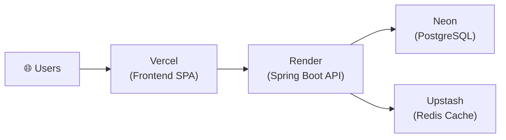

# 🚀 HiredAI — AI-Powered Job Application & Multi-Feed Aggregation Platform

**HiredAI** is a high-performance, full-stack job application and feed aggregation platform designed to streamline remote job hunting. It aggregates real-time job listings across public job boards and custom feeds (RSS, Atom, JSON APIs, and Web Automation) into a single unified workspace, matching candidates against job roles using automated resume skill extraction and match scoring algorithms.

---

## 🛠️ Technology Stack & Architectural Choices

### **Backend Core: Java 21 & Spring Boot 3**
- **Why Java 21?**: Capitalizes on modern Java features (Record types, Pattern Matching, Sealed Interfaces, Virtual Threads compatibility) for clean, type-safe, and concurrent backend code execution.
- **Why Spring Boot 3?**: Provides enterprise-grade dependency injection, robust JPA/Hibernate ORM capabilities, declarative security (`Spring Security`), and seamless REST controller abstractions with Spring Data JPA specifications for dynamic search filtering.

### **Frontend: React 18, TypeScript & Material-UI (MUI v5)**
- **Why React 18 & TypeScript?**: Ensures strict compile-time type safety across API DTOs and page state, enabling scalable component architectures with zero dynamic type bugs.
- **Why MUI v5 & Custom Styling System**: Built using custom visual tokens (custom HSL/HEX palette, responsive breakpoints, smooth animations, slide-up drawers for mobile filtering) to deliver a state-of-the-art visual experience across all screen sizes.

### **Database & Caching: PostgreSQL & Redis**
- **Why PostgreSQL?**: Serves as the primary relational database for ACID-compliant persistence of candidate user profiles, uploaded resume text JSON structures, encrypted platform credentials, custom job feeds, and saved job tracker records.
- **Why Redis?**: Used as an in-memory high-speed cache and data store for rapid data access, caching search results, platform statuses, rate-limiting counters, and session state to eliminate redundant DB queries during high-concurrency feed sweeps.

### **Background Task Execution: Spring Scheduling Framework**
- **Why `@Scheduled` & `@Async`?**: Drives periodic automated background feed ingestion sweeps ([`JobIngestionScheduler.java`](file:///Users/riddhi/Desktop/Vesis/HiredAI/backend/src/main/java/com/hiredai/backend/service/JobIngestionScheduler.java#L23)) and on-demand refresh triggers without requiring heavy external message broker dependencies.

### **Document Extraction & Processing: Apache Tika & PDFBox**
- **Why Apache Tika & PDFBox?**: Provides robust, multi-format text extraction from candidate resumes (PDF, DOCX, DOC). Converts unstructured document streams into structured text for tokenized skill matching algorithms.

### **Browser Automation & Web Scraping: Selenium & ChromeDriver**
- **Why Selenium?**: Drives real, automated browser sessions (`LinkedInEasyApplyAdapter`, `IndeedAdapter`) to fetch live search listings from platforms without public developer APIs.

---

## 🏗️ Software Design Patterns & Architecture

### **1. Adapter Pattern (`JobSourceAdapter` & `PlatformAdapter`)**
- **Class**: [`com.hiredai.backend.adapter.JobSourceAdapter`](file:///Users/riddhi/Desktop/Vesis/HiredAI/backend/src/main/java/com/hiredai/backend/adapter/JobSourceAdapter.java)
- **Purpose**: Abstracts job-fetching logic across vastly different data sources (RSS/Atom feeds, JSON REST APIs, and Selenium browser automation) behind a uniform interface.
- **Benefit**: Adding a new job source or platform requires zero modifications to existing controllers or core domain services — strictly adhering to the **Open/Closed Principle (SOLID)**.

### **2. Repository Pattern (`Spring Data JPA`)**
- **Class**: [`com.hiredai.backend.repository.JobListingRepository`](file:///Users/riddhi/Desktop/Vesis/HiredAI/backend/src/main/java/com/hiredai/backend/repository/JobListingRepository.java)
- **Purpose**: Decouples domain logic from SQL query execution and database interactions.
- **Benefit**: Allows clean, testable data access logic and dynamic criteria building via `Specification<JobListing>`.

### **3. Strategy / Dynamic Pipeline Pattern (`MatchingService`)**
- **Class**: [`com.hiredai.backend.service.MatchingService`](file:///Users/riddhi/Desktop/Vesis/HiredAI/backend/src/main/java/com/hiredai/backend/service/MatchingService.java)
- **Purpose**: Tokenizes candidate resume skills and job requirements into normalized term frequency vectors to compute dynamic, real-time 0–100% match scores.
- **Benefit**: Keeps scoring algorithms modular and replaceable (e.g., swapping keyword overlap for embeddings/vector search without breaking consumer code).

### **4. Scheduled Task Ingestion Pattern (`JobIngestionScheduler`)**
- **Class**: [`com.hiredai.backend.service.JobIngestionScheduler`](file:///Users/riddhi/Desktop/Vesis/HiredAI/backend/src/main/java/com/hiredai/backend/service/JobIngestionScheduler.java)
- **Purpose**: Periodically triggers automated feed updates across all registered adapters every 5 minutes (or on-demand via the `/api/jobs/refresh` REST endpoint) using parallel adapter sweeps and batch database upserts.
- **Benefit**: Ensures candidate job feeds remain continuously up-to-date with sub-second ingestion performance and zero manual refresh required.

---

## ✨ Key Features

- 🔍 **Unified Multi-Source Job Feed**: Aggregates remote roles across Google Jobs, WeWorkRemotely, RemoteOK, Himalayas, Jobicy, Remotive, Arbeitnow, and custom user-defined RSS/Atom/JSON feeds into one feed.
- 🎯 **Automated AI Resume Skill Matcher**: Parses PDF/DOCX resumes and computes realistic 0–100% match scores for every listing.
- ⚡ **Persistent Multi-Parameter Filtering**: Seamlessly filter job feeds by Keywords, Location, Platform, and Match Score sort order. Active filter state persists across tab switches and browser navigation.
- 📱 **100% Mobile-Friendly & Responsive**: Responsive design with slide-up filter bottom-sheets, custom touch targets, and flexible card grids across all viewports.
- 🔒 **Security & Authentication**: JWT stateless authentication with password preview toggles and BCrypt password hashing.

---

## ☁️ Cloud Deployment & Infrastructure

The platform is deployed across four managed cloud services — each selected for its **forever-free tier** and production-grade reliability:



| Service | Role | Why This Platform |
|---------|------|-------------------|
| **[Vercel](https://vercel.com)** | Frontend hosting (React SPA) | Edge-deployed CDN with instant global delivery, automatic Git-based CI/CD on every push, and built-in SPA routing via `vercel.json` rewrites. |
| **[Render](https://render.com)** | Backend hosting (Spring Boot Docker) | Native Docker runtime support, automatic deploys from GitHub, built-in health checks via `/actuator/health`, and zero-config HTTPS. |
| **[Neon](https://neon.tech)** | Managed PostgreSQL database | Serverless Postgres with 500MB free storage (no expiry), branching support for dev/prod isolation, and native SSL connections (`sslmode=require`). |
| **[Upstash](https://upstash.com)** | Managed Redis cache | Serverless Redis with TLS encryption, REST API fallback, and per-request pricing (10K commands/day free) — ideal for caching job search results and rate-limiting. |

### Live URLs
- **Frontend App**: [https://hiredai-remote.vercel.app](https://hiredai-remote.vercel.app)
- **Backend REST API**: [https://hiredai-backend-nwjy.onrender.com](https://hiredai-backend-nwjy.onrender.com)
- **Swagger UI (Interactive API Docs)**: [https://hiredai-backend-nwjy.onrender.com/swagger-ui.html](https://hiredai-backend-nwjy.onrender.com/swagger-ui.html)
- **OpenAPI 3.0 Spec**: [https://hiredai-backend-nwjy.onrender.com/v3/api-docs](https://hiredai-backend-nwjy.onrender.com/v3/api-docs)

---

## 🐳 Running Locally via Docker

The entire platform (Postgres, Redis, Spring Boot backend, and Nginx/React frontend) is containerized for one-command deployment.

```bash
docker-compose up --build
```
- **Frontend App**: http://localhost:5173
- **Backend REST API**: http://localhost:8080
- **Swagger API Docs (Local)**: http://localhost:8080/swagger-ui.html
- **OpenAPI Spec (Local)**: http://localhost:8080/v3/api-docs

---

## 📁 Repository Structure

```
HiredAI/
├── backend/                  # Spring Boot 3 Java 21 REST API
│   ├── src/main/java/com/hiredai/backend/
│   │   ├── adapter/          # Adapter pattern implementations (JobSourceAdapter)
│   │   ├── controller/       # REST API endpoints
│   │   ├── dto/              # Request/Response Data Transfer Objects
│   │   ├── entity/           # JPA Database Entities
│   │   ├── repository/       # Spring Data JPA Repositories & Specifications
│   │   ├── security/         # Spring Security & JWT Filter
│   │   └── service/          # Business logic & Matching algorithms
│   └── Dockerfile            # Multi-stage Maven/Java build container
├── frontend/                 # React 18 + TypeScript SPA
│   ├── src/
│   │   ├── api/              # Axios API client services
│   │   ├── components/       # Layouts, Navigation Drawers & UI elements
│   │   ├── pages/            # JobFeed, Resumes, SavedJobs, JobSources, Auth pages
│   │   └── store/            # State management (Zustand)
│   └── Dockerfile            # Multi-stage Vite/Nginx production container
└── docker-compose.yml        # Orchestration for Postgres, Redis, Backend, Frontend
```
